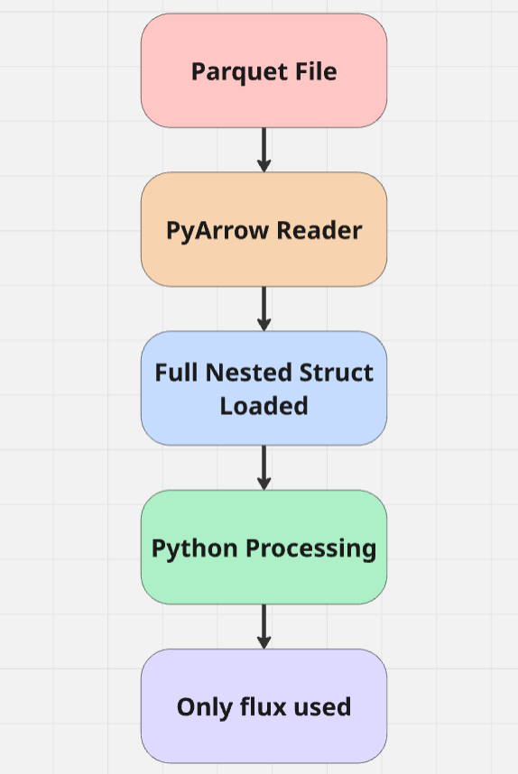
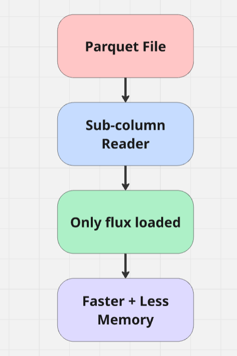

# Application Title

## Contributor Information
* **Name: Kathrina Elangbam**
* **Time-zone: IST (UTC +5:30)**
* **Matrix/slack/IRC Handle:**
* **Github/forge username: Kathrina-dev**
* **Blog:**
* **Blog RSS feed:**
* **PR link(s):**
  * Proposal PR: https://github.com/OpenAstronomy/gsoc-proposals/pull/36

### Background
I am Kathrina Elangbam, a Sophomore studying at VIT-AP University, India. I started my programming journey when I entered college. I learnt frontend development and made lots of projects as a Fresher. After a couple dozen projects I landed my first client and have been freelancing ever since.

It's been over a year now since I learnt something new or explored a completely different domain. I feel I’ve reached a point where I want to challenge myself with deeper systems-level problems. I want to re-ignite my curiosity for learning and expand my knowledge outside my current perception.

### Interest in OpenAstronomy
I've always been exposed to the field of astronomy since I was a kid. My dad would look at the night sky with a couple different telescopes almost everyday. We would spot solar flares, nebular explosions and stars in the sky. I think a huge part of contributing to this project stems from wanting to give back to the astronomy community and my dad.

## Project Proposal Application
**Proposal Title: pyarrow Improvements for Astronomy**

**Organisation: LINCC Frameworks (OpenAstronomy)**

### **Summary:**

Modern astronomical datasets rely heavily on nested data structures—such as lists of observations per object—stored efficiently using Parquet and Arrow. However, PyArrow currently lacks key capabilities when working with these nested types, leading to unnecessary I/O, higher memory usage, and limited computational expressiveness. This project aims to improve PyArrow’s handling of nested data by:

- Enabling sub-column selection for list-struct types

- Adding missing compute kernels for nested arrays

- Improving multi-threaded read performance for struct-list columns

## Understanding the Problem

## Proposed Approach

### Deliverables
**1. Sub-column selection support for list-struct types in the Parquet reader**

**2. Implementation of at least one missing compute kernel (e.g., replace_with_mask or broadcasting support for nested arrays)**

**3. Improvements to multi-threaded read performance for struct-list columns**

**4. Unit tests, benchmarks, and documentation for all implemented features**

**5. Upstream contributions (PRs) to Apache Arrow**

### Description/timeline

|Period|Description|
|------|-----------|
|Community Bonding period| Understand LINCC workflows, Parquet usage patterns, and existing limitations |
| week 1 (May 25 – May 31) | Build Arrow from source, understand Parquet reader internals|
| week 2 (June 1 – June 7) | Study nested types (ListArray, StructArray) and column pruning|
| week 3 (June 8 – June 12) | Identify limitations in sub-column selection|
| week 4 (June 13 – June 18) | Prototype sub-column read approach|
| week 5 (June 19 – June 25) | Implement sub-column selection in Parquet reader|
| week 6 (June 26 – July 2) | Add tests + benchmarks|
| week 7 (July 3 – July 9) | Submit PR and iterate based on feedback|
| week 8 (July 11 – July 14) | Midterm evaluation|
| week 9 (July 15 – July 20) | Work on compute kernels (e.g. replace_with_mask)|
| week 10 (July 21 – July 27) | Extend kernel support to nested arrays|
| week 11 (July 28 – Aug 3) | Investigate multi-threaded read limitations|
| week 12 (Aug 4 – Aug 10) | Optimize + benchmark|
| week 13 (Aug 10 – Aug 18) | Documentation + cleanup|
| week 14 (Aug 18 – Aug 24) | Final submission |

## GSoC

### Have you participated previously in GSoC? When? With which project?

No

### Are you also applying to other projects?

Yes, I am applying to another project related to 3D systems, but I'm interested in this project because I want to explore huge data systems and workflows

### Schedule availability
I have academic commitments during:

**June 13 – June 18** (unit tests)

**July 15 – July 20** (semester exams)

During exams, I will contribute fewer hours (10 hrs per week), and during free weeks I plan to contribute more (35–40 hrs per week).

## Other comments

I tend to learn by building small prototypes first. For this proposal as well, I started by experimenting with a small Parquet-based project to understand how nested data behaves during reads.

While this does not solve the underlying issue, it helped me better understand where problems arise and reinforced the need for proper support at the Arrow level.

## Nested Astronomy Data Visualizer

Project Link: https://kathrina-dev.github.io/nested-astronomy-data-visualizer/

Project Repo: https://github.com/Kathrina-dev/nested-astronomy-data-visualizer

## Open Source Contributions
I have also contributed to open-source projects such as Plone, where I became familiar with how to work with huge codebases, how to make PRs and how to test and document code.

  * Fix Moderate Comments control panel visibility based on Discussion Support addon installation #7878 in plone/volto: https://github.com/plone/volto/pull/7878
  * Add Vitest test for .well-known handling in production build #7868 in plone/volto: https://github.com/plone/volto/pull/7868
  * Fix copying of .well-known directory from public/ in production builds #7839 in plone/volto: https://github.com/plone/volto/pull/7839
  * Fix grammar in Volto development overview #7802 in plone/volto: https://github.com/plone/volto/pull/7802